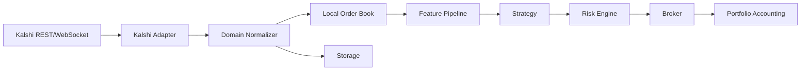
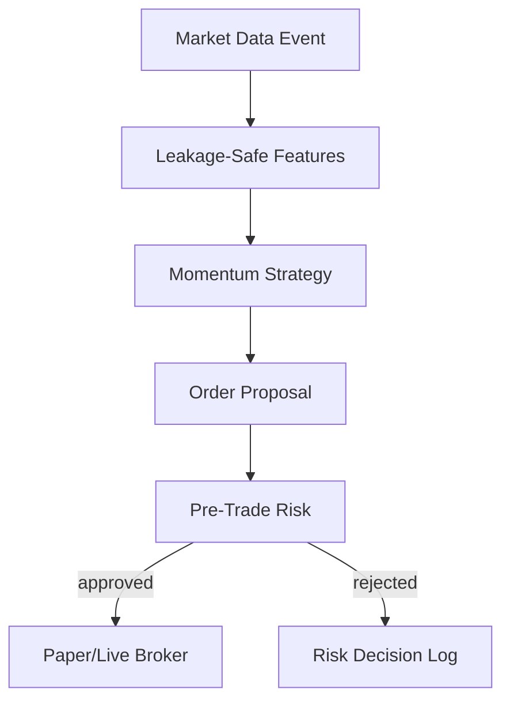
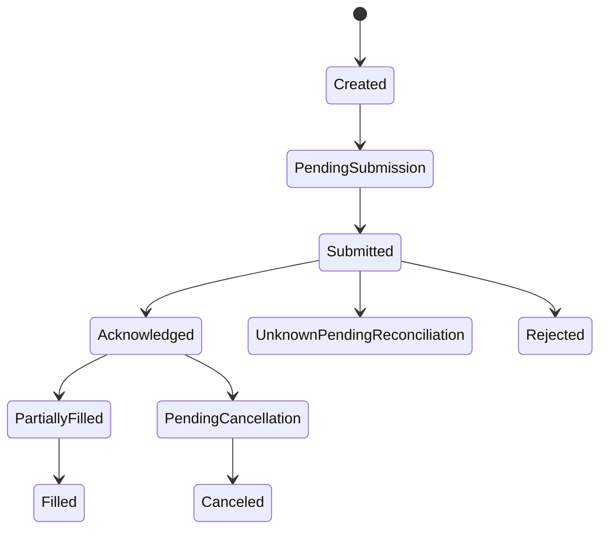
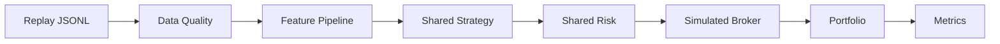
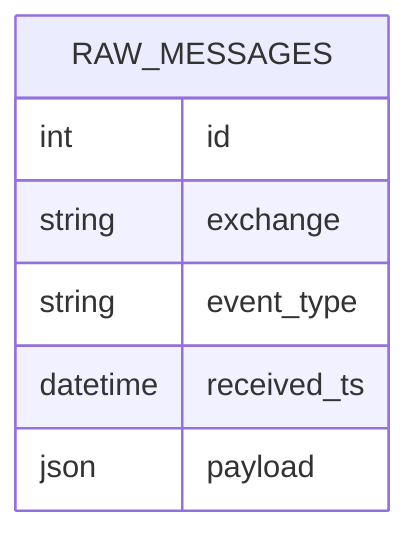

# Architecture

## Live Data Flow

```mermaid
flowchart LR
  K["Kalshi REST/WebSocket"] --> A["Kalshi Adapter"]
  A --> N["Domain Normalizer"]
  N --> B["Local Order Book"]
  N --> S["Storage"]
  B --> F["Feature Pipeline"]
  F --> T["Strategy"]
  T --> R["Risk Engine"]
  R --> E["Broker"]
  E --> P["Portfolio Accounting"]
```

## Trading Decision Flow

```mermaid
flowchart TD
  M["Market Data Event"] --> F["Leakage-Safe Features"]
  F --> S["Momentum Strategy"]
  S --> O["Order Proposal"]
  O --> R["Pre-Trade Risk"]
  R -->|approved| B["Paper/Live Broker"]
  R -->|rejected| L["Risk Decision Log"]
```

## Order Lifecycle

```mermaid
stateDiagram-v2
  [*] --> Created
  Created --> PendingSubmission
  PendingSubmission --> Submitted
  Submitted --> Acknowledged
  Acknowledged --> PartiallyFilled
  PartiallyFilled --> Filled
  Acknowledged --> PendingCancellation
  PendingCancellation --> Canceled
  Submitted --> UnknownPendingReconciliation
  Submitted --> Rejected
```

## Backtest Flow

```mermaid
flowchart LR
  R["Replay JSONL"] --> Q["Data Quality"]
  Q --> F["Feature Pipeline"]
  F --> S["Shared Strategy"]
  S --> X["Shared Risk"]
  X --> B["Simulated Broker"]
  B --> P["Portfolio"]
  P --> M["Metrics"]
```

## Database Relationships

```mermaid
erDiagram
  RAW_MESSAGES {
    int id
    string exchange
    string event_type
    datetime received_ts
    json payload
  }
```
